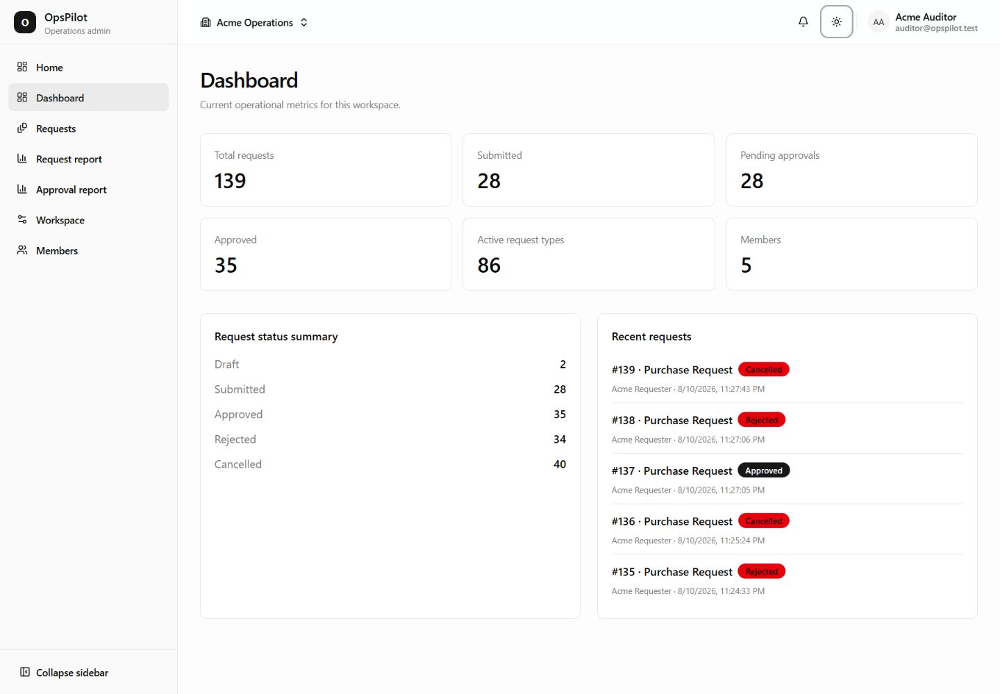
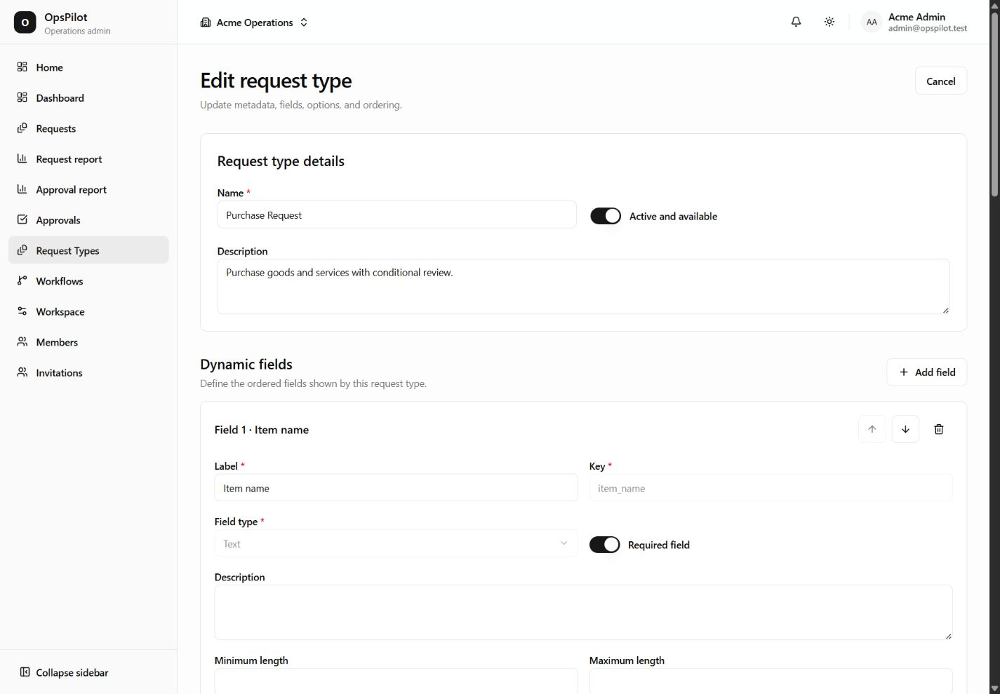
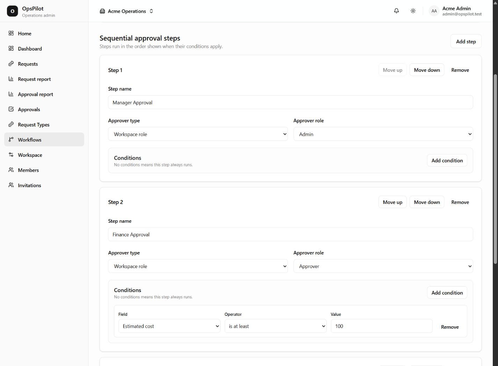
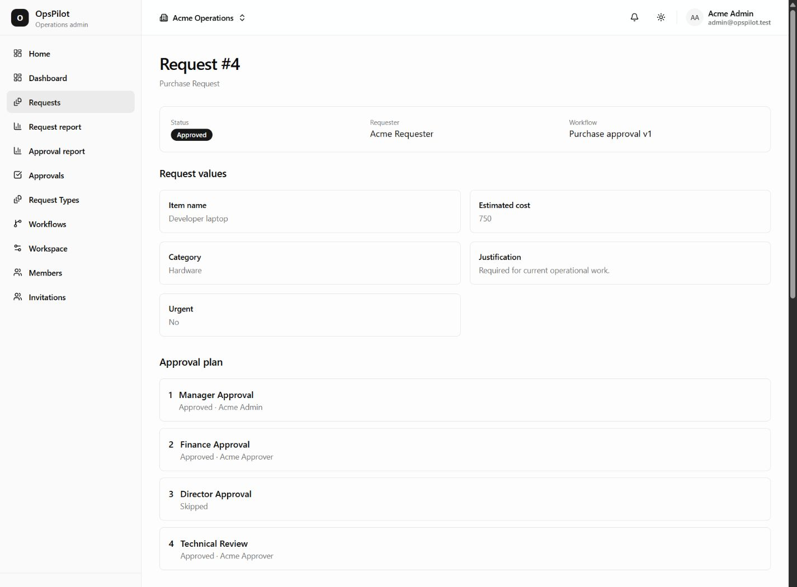
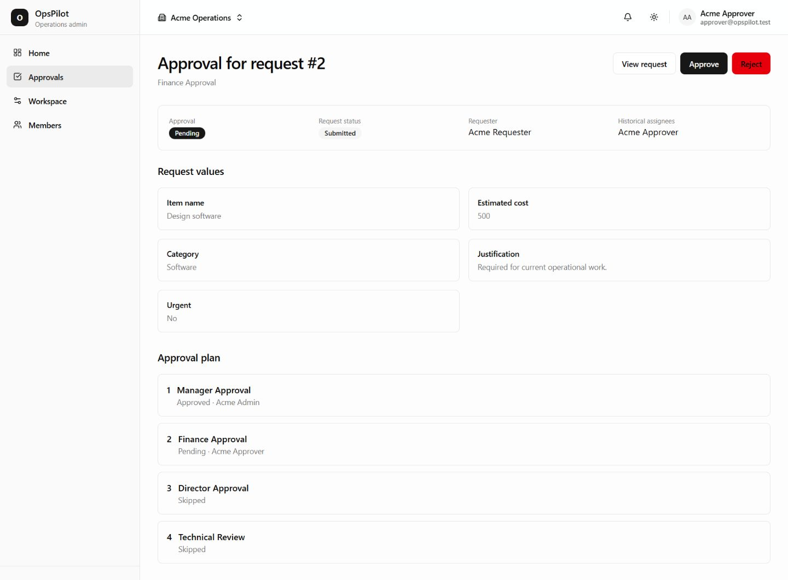
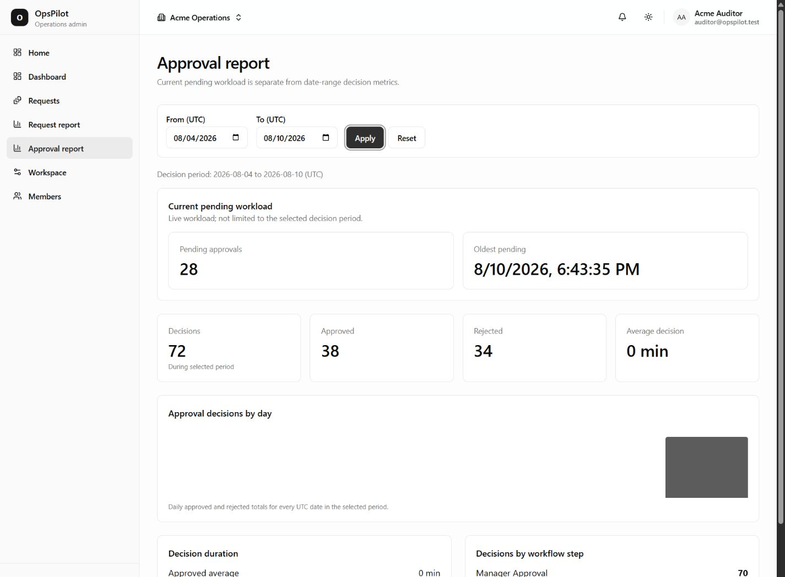

# OpsPilot

**Multi-tenant workflow and approval platform built with Laravel and Vue.**

OpsPilot is an internal operations platform for teams that need configurable request forms, approval workflows, permissions, collaboration, notifications, and reporting.

Instead of hard-coding a separate process for purchases, leave, maintenance, access requests, or vendor onboarding, administrators can define reusable request types and versioned approval workflows directly from the application.

> Built as a full-stack architecture showcase focused on multi-tenancy, workflow design, authorization, concurrency, historical integrity, and production-minded SPA patterns.

---

## Product Overview



A workspace can create its own operational processes without changing application code.

Typical use cases include:

* Purchase requests
* Expense approvals
* Leave requests
* Maintenance requests
* Equipment or access requests
* Stock corrections
* Vendor onboarding

Administrators define the request fields and approval workflow. Users create and submit requests, while assigned approvers process them sequentially according to workflow conditions.

Each workspace is isolated from the others, with its own members, roles, request types, workflows, requests, approvals, and reporting.

---

# Core Features

## Dynamic Request Types

Administrators can build configurable request forms instead of relying on hard-coded schemas.



Supported field types include:

* Text
* Textarea
* Number
* Decimal
* Boolean
* Date
* Datetime
* Select
* Multiselect
* Email
* URL

Fields support:

* required state
* ordering
* type-specific validation
* select options
* numeric ranges
* text-length constraints
* stable field keys

The backend validates the field configuration itself, while the frontend provides a typed builder for editing the schema.

---

## Versioned Workflow Builder

Approval workflows are configurable and versioned rather than hard-coded.



Each workflow can contain:

* sequential approval steps
* role-based approvers
* specific-user approvers
* `all` / `any` condition logic
* typed field conditions
* ordered steps
* draft workflow versions
* publishing
* version history

Published workflow definitions are immutable.

When a workflow needs to change, OpsPilot creates a new draft version rather than rewriting the published definition.

```text
Workflow v1
   ↓ publish
Active v1

Need changes
   ↓ clone

Workflow v2 Draft
   ↓ publish

Archived v1
Active v2
```

This prevents configuration changes from rewriting the history of requests submitted against older workflow versions.

---

## Request Lifecycle

Requests move through an explicit lifecycle:

```text
Draft
  ↓
Submitted
  ├── Approved
  ├── Rejected
  └── Cancelled
```

Drafts can be saved and edited before submission.

At submission time, OpsPilot:

1. validates the complete request payload
2. binds the currently active workflow version
3. snapshots the request definition
4. evaluates workflow conditions
5. materializes the runtime approval plan
6. resolves approvers
7. activates the first applicable approval step



The request detail view preserves the submitted values, workflow version, approval chain, skipped conditional steps, and final state.

This means later request-type or workflow changes do not rewrite how an existing request is interpreted.

---

## Sequential Approval Engine

Approval steps are materialized when a request is submitted.

Only one approval is active at a time.

```text
Step 1
  ↓ approved
Step 2
  ↓ approved
Step 3
  ↓ approved
Request Approved
```

If an approval is rejected, the remaining waiting steps are cancelled and the request resolves as rejected.

Concurrency-sensitive transitions run inside database transactions with row locking and database constraints.

This protects against:

* duplicate approval actions
* two users acting on the same pending step
* multiple pending approvals on one request
* stale decisions after the request has already moved forward

---

## Approval Experience

Approvers receive an inbox containing the approvals currently assigned to them.

Each approval detail page includes the submitted request context, approval plan, historical assignees, and current decision controls.



Historical assignment and current authorization are treated separately.

An assignee may remain visible in the request history, while the backend still rechecks current membership and effective permission before allowing an approval action.

---

## Fine-Grained Authorization

OpsPilot separates workspace membership from effective permissions.

Default workspace roles include:

* Owner
* Admin
* Approver
* Requester
* Auditor

Authorization is enforced through Laravel policies and workspace-scoped permissions rather than trusting role names alone.

The frontend uses the same permission names to improve navigation and action presentation, but backend authorization remains authoritative.

---

## Collaboration & Audit Trail

Requests support:

* comments
* private attachments
* authenticated file downloads
* activity history
* actor attribution
* approval activity
* notification events

Attachments are stored privately and streamed through authenticated backend endpoints.

Internal filesystem paths are never exposed to the frontend.

Comments and uploaded attachments also become part of the request activity history.

---

## Notifications

OpsPilot includes queued notifications for events such as:

* approval assignment
* request approval
* request rejection
* request cancellation
* new comments
* new attachments
* workspace invitations

Notification work is scheduled after the business transaction commits.

A notification delivery failure therefore cannot roll back a successful request or approval transition.

The notification inbox is user-global rather than workspace-scoped, allowing a notification to safely switch the active workspace before deep-linking to its request or approval.

---

## Dashboard & Reports

Workspace reporting is calculated by the backend rather than reconstructed from paginated frontend data.



The dashboard provides current operational metrics for the selected workspace, while dedicated reports separate live workload from date-scoped historical activity.

The approval report includes:

- current pending approvals
- oldest pending approval
- approved and rejected decision totals
- average decision duration
- daily approval-decision trends
- decisions grouped by workflow step

Request reporting is also available for:

- request creation trends
- current status distribution of requests created during a period
- lifecycle throughput
- resolution times
- request-type breakdowns

A deliberate distinction is made between **current state** and **events within a selected reporting period**.

For example, current pending approvals are shown separately from date-scoped approval decisions, so changing the report period does not incorrectly redefine the live workload.

---

# Engineering Highlights

## Multi-Tenancy

Tenant isolation is enforced at multiple layers:

```text
Authenticated User
      ↓
Current Workspace Context
      ↓
Scoped Route Binding
      ↓
Policy / Permission Checks
      ↓
Workspace-Scoped Queries
```

Laravel resolves the active workspace from the authenticated user's current membership.

Nested resources also use scoped route binding so a request, workflow, field, approval, or attachment cannot simply be rebound through another workspace URL.

On the frontend, tenant-scoped query keys include the workspace ID:

```text
['workspace', workspaceId, feature, ...]
```

When the workspace changes, old tenant queries are cancelled and removed.

Mutation callbacks also capture the workspace in which they started, so a late result from Workspace A cannot update the UI after the user switches to Workspace B.

---

## Immutable Workflow Versioning

A workflow engine must preserve historical behavior.

Changing a workflow today should not make last month's request suddenly follow the new definition.

OpsPilot therefore treats published workflows as immutable.

A new version is created whenever administrators need to change the workflow.

Requests bind to a specific workflow version when submitted.

---

## Runtime Approval Materialization

Requests do not repeatedly evaluate the current workflow during every approval action.

Instead:

```text
Published Workflow
       +
Submitted Payload
       ↓
Condition Evaluation
       ↓
Materialized Approval Rows
       ↓
Sequential Runtime Decisions
```

This gives the request a stable runtime plan.

Benefits include:

* historical integrity
* deterministic progression
* stable approval history
* simpler runtime transitions
* clearer auditability

---

## Concurrency-Safe State Transitions

Critical request and approval transitions are handled transactionally.

Conceptually:

```text
BEGIN TRANSACTION

Lock Request
Lock Approval

Recheck:
- request state
- approval state
- assignment
- membership
- permission

Apply transition
Activate next approval
Record activity

COMMIT
```

Database constraints provide a final safety layer in addition to application-level checks.

---

## Backend-Authoritative Business State

The frontend does not attempt to duplicate high-consequence business rules.

For mutations such as:

* submit
* approve
* reject
* cancel
* publish workflow

the frontend sends the command, then invalidates/refetches authoritative server state.

This reduces client/server divergence and makes concurrent behavior safer.

---

# Frontend Architecture

OpsPilot uses explicit ownership for different kinds of state.

| State                                        | Owner                   |
| -------------------------------------------- | ----------------------- |
| Authenticated user and selected workspace    | Pinia                   |
| Server resources                             | TanStack Vue Query      |
| Filters, pagination and shareable navigation | Vue Router              |
| Temporary forms, dialogs and UI state        | Vue refs/reactive state |

Pinia is deliberately not used as a second backend database.

```text
Pinia
├── authenticated user
├── current workspace
└── notification summary

TanStack Query
├── requests
├── approvals
├── workflows
├── members
├── comments
├── notifications
└── reports

Router
├── page
├── filters
├── report dates
└── status

Local State
├── form fields
├── dialogs
├── builders
└── transient validation
```

---

# Application Architecture

```text
Vue View
   ↓
TanStack Query
   ↓
Feature API Module
   ↓
Credentialed Fetch Client
   ↓
Laravel API Route
   ↓
Sanctum Authentication
   ↓
Workspace Context
   ↓
Form Request / Policy
   ↓
Controller
   ↓
Action / Domain Service
   ↓
Eloquent / Database
   ↓
API Resource
   ↓
Authoritative Frontend Refetch
```

Backend controllers stay thin.

Business mutations primarily live in domain actions, while reusable permission, workflow-evaluation, notification, and reporting behavior lives in dedicated support/services.

---

# Tech Stack

## Backend

* PHP 8.4
* Laravel 13
* MySQL 8
* Laravel Sanctum
* Spatie Laravel Permission
* Laravel Queues
* Database Notifications
* Laravel Filesystem
* PHPUnit

## Frontend

* Vue 3
* TypeScript
* Vite
* Vue Router
* Pinia
* TanStack Vue Query
* Tailwind CSS
* shadcn-vue / Reka UI
* Lucide Icons
* Vitest
* Playwright

---

# Authentication

The Vue SPA uses Laravel Sanctum stateful session authentication.

```text
GET /sanctum/csrf-cookie
        ↓
POST /api/v1/auth/session
        ↓
Session Cookie
        ↓
auth:sanctum API requests
```

The session-login endpoint intentionally runs through Laravel's web middleware stack so standard session and CSRF protection apply.

Personal access token authentication is supported separately.

---

# Testing

OpsPilot includes automated coverage across backend domain behavior, frontend logic, and browser workflows.

## Backend

The Laravel suite covers:

* authentication
* workspaces
* permissions
* invitations
* tenant isolation
* dynamic request types
* workflow versions
* condition evaluation
* request submission
* sequential approvals
* concurrency behavior
* collaboration
* attachments
* activity
* notifications
* notification failure isolation
* dashboard/reporting
* complete end-to-end flows

Final verified backend suite:

```text
208 tests
1,621 assertions
```

## Frontend Unit Tests

Vitest covers areas such as:

* query-key isolation
* workspace safety
* stale mutation guards
* authorization presentation
* route resolution
* dynamic form serialization
* workflow state
* partial-save recovery
* stale approval handling
* notification navigation
* report filtering and presentation

Final verified suite:

```text
124 tests
```

## Browser E2E

Playwright exercises the real Laravel API rather than replacing it with mocks.

Final browser matrix:

```text
Chromium   16 / 16
Firefox    16 / 16
WebKit     16 / 16

Total      48 / 48
```

The browser journeys cover authentication, workspace administration, dynamic request types, workflows, requests, approvals, reports, authorization boundaries, and responsive navigation.

---

# Project Structure

```text
OpsPilot/
├── opspilot-api/       # Laravel API
├── opspilot-admin/     # Vue SPA
├── docs/
│   ├── screenshots/
│   └── engineering documentation
└── README.md
```

Backend and frontend live in the same repository while remaining independently structured applications.

---

# Local Development

## Requirements

* PHP 8.4+
* Composer
* Node.js
* npm
* MySQL 8+

### Backend

```bash
cd opspilot-api

composer install
cp .env.example .env
php artisan key:generate
```

Configure the database in `.env`, then run:

```bash
php artisan migrate --seed
php artisan serve
```

### Frontend

```bash
cd opspilot-admin

npm install
npm run dev
```

The Vite development configuration proxies frontend API traffic to Laravel.

---

# Demo Accounts

The seeded environment includes representative workspace roles.

| Role      | Email                     |
| --------- | ------------------------- |
| Owner     | `owner@opspilot.test`     |
| Admin     | `admin@opspilot.test`     |
| Approver  | `approver@opspilot.test`  |
| Requester | `requester@opspilot.test` |
| Auditor   | `auditor@opspilot.test`   |

Password:

```text
password
```

> These credentials are intended only for the local seeded demo environment.

---

# Verification

### Laravel

```bash
cd opspilot-api
php artisan test
```

### Vue

```bash
cd opspilot-admin

npm run type-check
npm run lint
npm run test:unit
npm run build
npm run test:e2e
```

---

# Scope Decisions

Some deliberate scope decisions:

* published workflows are immutable
* approval decisions do not currently include rejection reasons
* comments are immutable
* private attachments do not currently expose deletion
* notifications are asynchronous rather than real-time
* reports do not currently expose file export
* frontend permissions improve UX but never replace backend authorization

The project intentionally focuses on workflow design, authorization, multi-tenancy, concurrency, and SPA architecture rather than maximizing feature count.

---

# Why I Built OpsPilot

OpsPilot was built as a complete engineering project rather than a collection of disconnected demo features.

It explores the kinds of problems that appear in real internal business systems:

* How should tenant isolation be enforced?
* How do workflows evolve without rewriting history?
* How should concurrent approval decisions be handled?
* Where should authorization live?
* What belongs in frontend global state versus server state?
* How should the UI recover when a multi-request operation partially succeeds?
* How do you prevent stale tenant data after workspace switching?
* How should asynchronous notifications interact with committed business transactions?

The project demonstrates full-stack ownership across database design, Laravel domain architecture, API design, authorization, Vue application architecture, testing, and operational UX.
